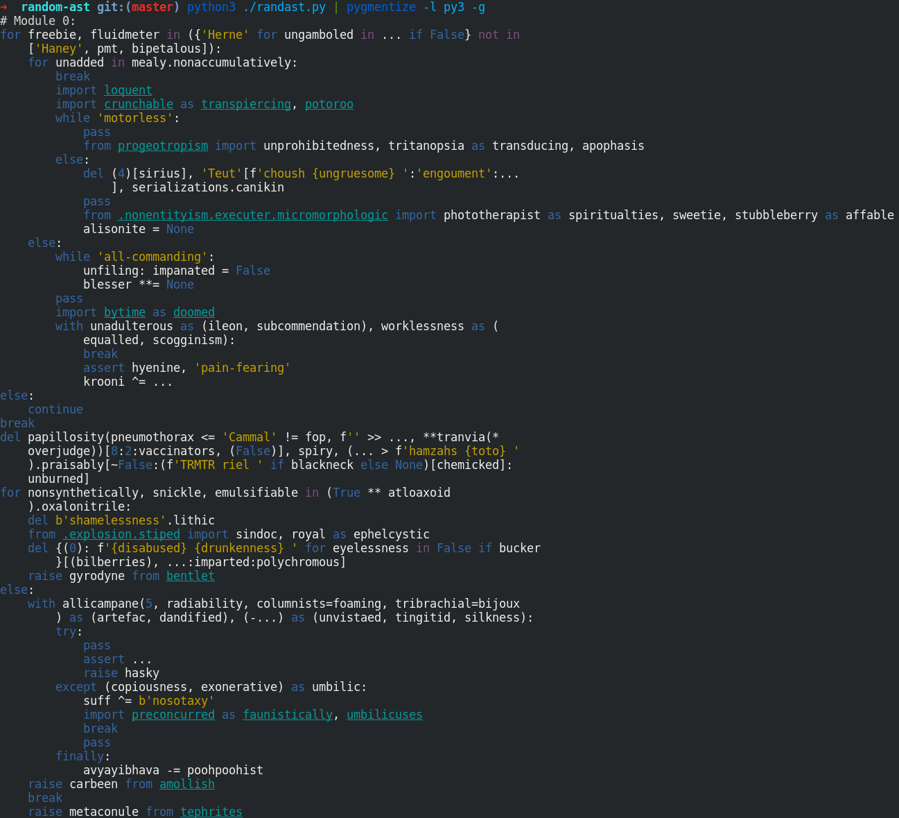

# random-ast

Generates random python scripts

Resources:

* [ast module documentation](https://docs.python.org/3/library/ast.html)
* [better AST docs](https://greentreesnakes.readthedocs.io/en/latest/)

Todo:

* [x] Literals
    * [x] number
    * [x] string
    * [x] formatted value
    * [x] joined string
    * [x] bytes
    * [x] list
    * [x] tuple
    * [x] set
    * [x] dict
    * [x] ellipsis
    * [x] `True`, `False` and `None`
* [ ] Variables
    * [x] simple
    * [ ] starred
* [ ] Expressions
    * [x] unary operations
    * [ ] binary operations
    * [ ] bool operations
    * [ ] comparisons
    * [ ] function call
    * [ ] inline if expression
    * [ ] attribute access
    * [ ] index subscripting
    * [ ] slice subscripting
    * [ ] advanced slicing
    * [ ] list comprehension
    * [ ] set comprehension
    * [ ] generator expression
    * [ ] dict comprehension
* [ ] Statements
    * [ ] assignment
    * [ ] annotated assignment
    * [ ] augmented assignment
    * [ ] print
    * [ ] raise
    * [ ] assert
    * [ ] delete
    * [ ] pass
    * [ ] import
    * [ ] import from
* [ ] Control flow
    * [ ] if block
    * [ ] for loop
    * [ ] while loop
    * [ ] break
    * [ ] continue
    * [ ] try blocks
    * [ ] context managers
* [ ] Function and class definitions
    * [ ] function definition
    * [ ] lambda function
    * [ ] return statement
    * [ ] yield, yield from
    * [ ] global, nonlocal
    * [ ] class definition
* [ ] Async and await
    * [ ] async function definition
    * [ ] await expression
    * [ ] async for loop
    * [ ] async context managers
